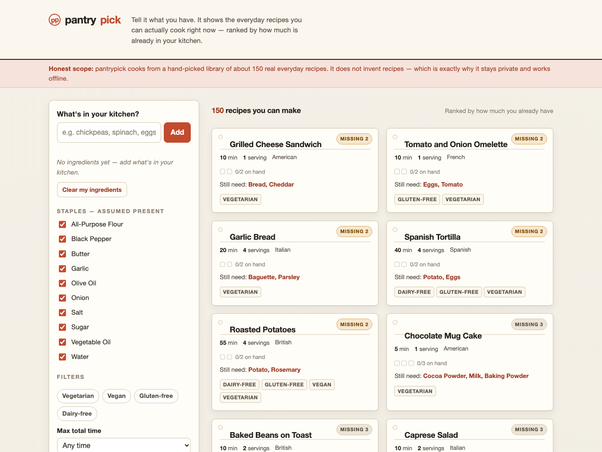

# pantrypick

Type the ingredients you already have and see the everyday recipes you can cook right now — ranked by how much of each one you own.



## Why it exists

Most recipe sites start from the dish and make you shop. pantrypick starts from your kitchen. You list what you have, and it sorts a hand-picked library of real, everyday recipes so the ones you can make *right now* come first, then the ones missing a single ingredient, then two, and so on. Every card tells you exactly what you still need, so the goal is simple: use up what's already there and waste less.

It is deliberately small and honest:

- **150 real recipes**, hand-written across 28 cuisines with quantified ingredients and numbered steps. Nothing is generated on the fly.
- **Fully offline and private.** The whole library ships inside the page, every match runs in your browser, and nothing is ever sent to a server. Your pantry is saved locally, not in an account. There is no login.
- **Speaks your kitchen's dialect.** Scallion and green onion, coriander and cilantro, aubergine and eggplant, capsicum and bell pepper, courgette and zucchini all match the same thing.
- **Staples assumed.** Salt, oil, flour, garlic and the like are treated as always-present, with a per-item toggle for when you're actually out.
- **Filters that mean something.** Vegetarian, vegan, gluten-free and dairy-free tags are checked against every ingredient list at build time, plus max-time and max-missing controls.

Built with [Astro](https://astro.build). No frameworks, no web fonts, no trackers — a single client-side island of vanilla JavaScript behind a strict Content-Security-Policy.

## Quickstart

```sh
npm install     # install dependencies
npm run dev      # local dev server at http://localhost:4321
npm run build    # production build into ./dist/
```

`npm run build` first regenerates the recipe corpus from `scripts/`. That step canonicalizes ingredient names, flags staples, and **fails the build** if any dietary tag contradicts an ingredient (for example a "vegan" recipe that lists cheese), so the tags you filter by are trustworthy.

## Disclaimer

pantrypick is provided **as is, without warranty of any kind**, under the MIT License (see [`LICENSE`](./LICENSE)). Dietary and allergen tags are a best-effort convenience, not a guarantee — ingredient products vary and cross-contamination happens. **Always read the ingredients yourself before cooking for allergies or a strict diet.** You are responsible for checking food safety, and the authors are not liable for any outcome of using this software.
